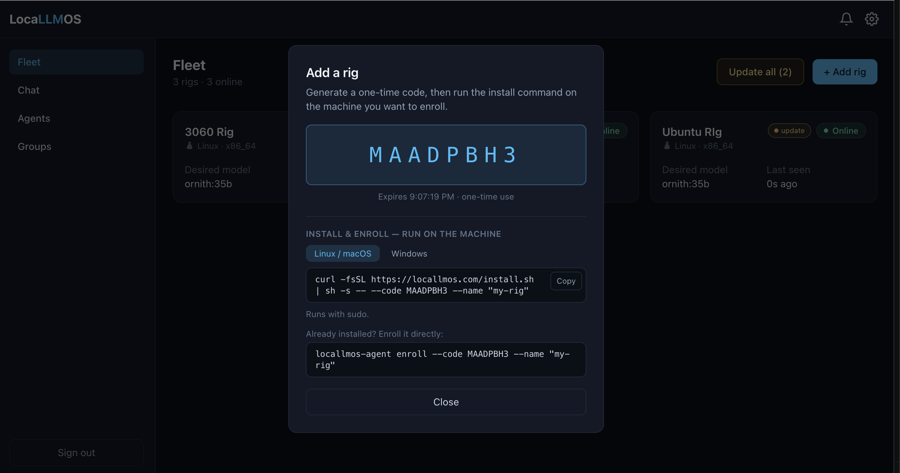
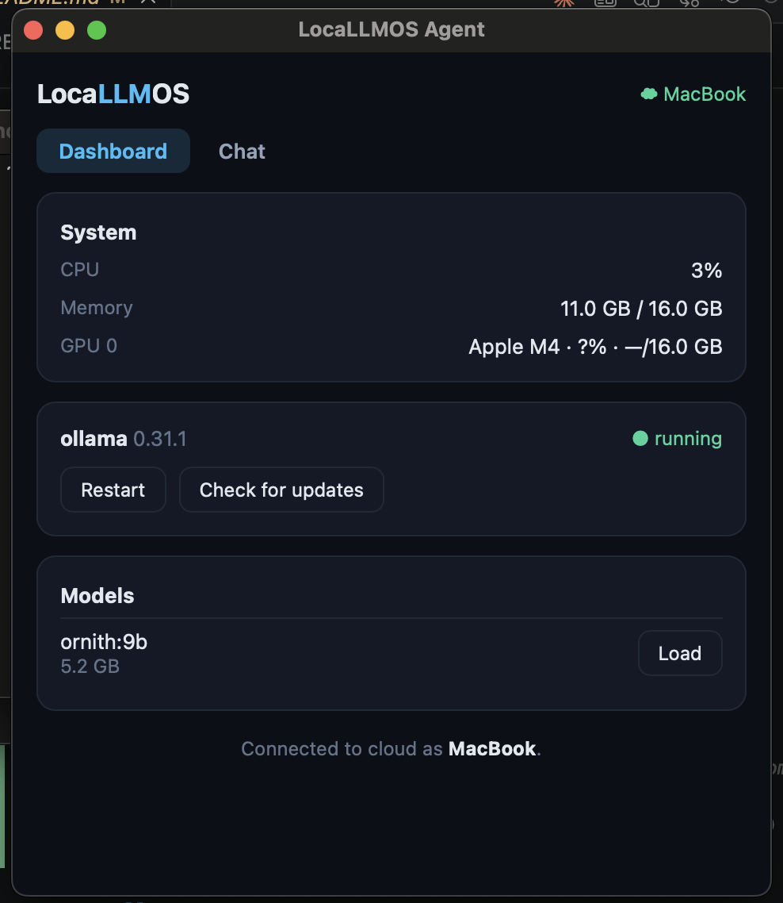
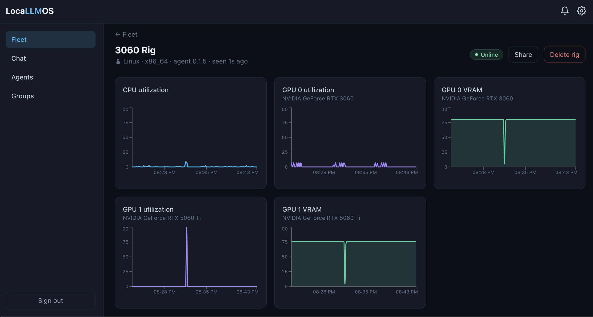
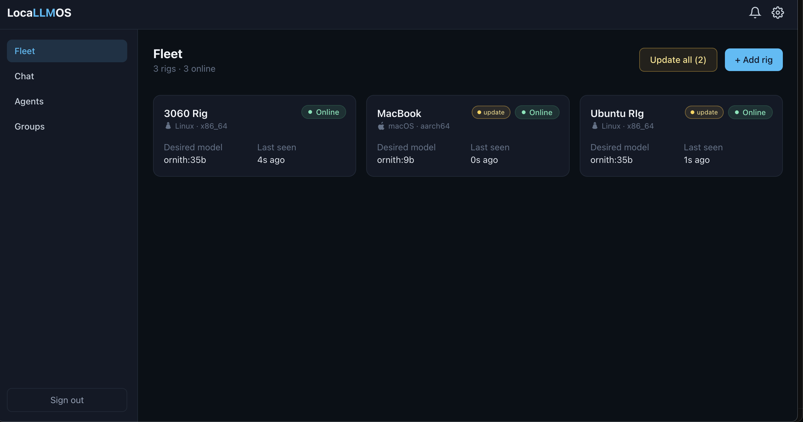
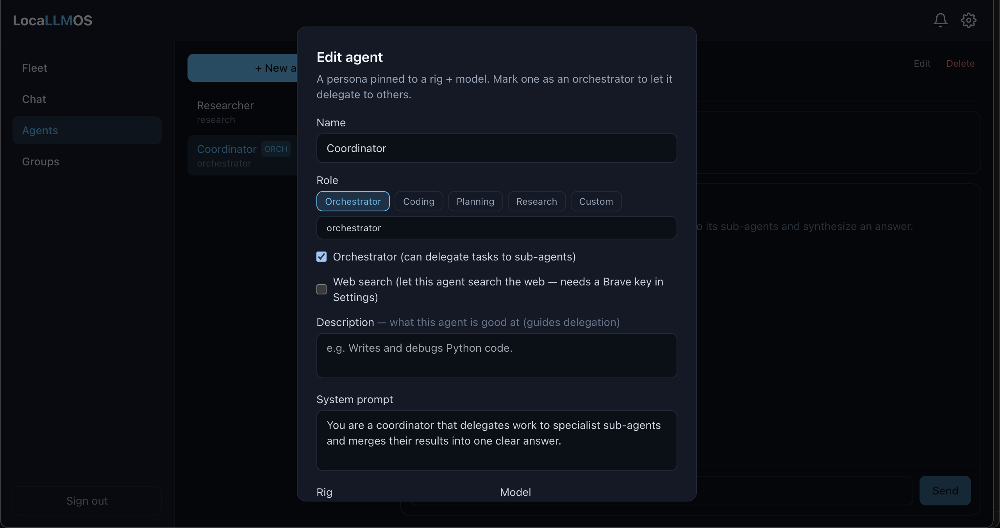
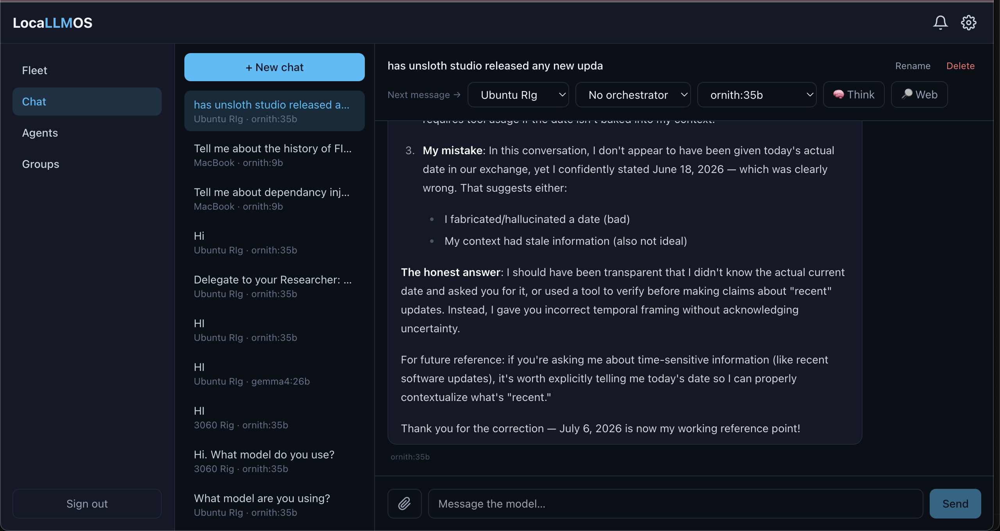

# LocalLMOS Agent

The open-source agent for [LocalLMOS](https://locallmos.com) — a cross-platform
(Linux, macOS, Windows) [Tauri](https://tauri.app) app that monitors and controls
the local LLM runtimes on a machine ("rig").

Run it **standalone** as a local control panel for your own models, or **connect it
to the cloud** to manage a fleet of rigs, share models, build teams, orchestrate
agents, and expose OpenAI-compatible endpoints from the LocalLMOS dashboard.

## Quick Start

1. Sign in at [locallmos.com](https://locallmos.com) and create or select a rig.
2. Copy the pairing code from the LocalLMOS dashboard.
3. Install the agent with the command for your operating system below.
4. Launch LocalLMOS Agent, enroll with the pairing code, and confirm the rig shows
   as online in the dashboard.
5. Start managing local runtimes, models, and OpenAI-compatible endpoints from
   the desktop tray app or the LocalLMOS dashboard.










## Install

**Linux / macOS (Apple Silicon):**
```sh
curl -fsSL https://locallmos.com/install.sh | sh
```

**Windows (elevated PowerShell):**
```powershell
iex ((curl.exe -fsSL https://locallmos.com/install.ps1) -join "`n")
```

This installs a signed binary to `/usr/local/bin` on Linux, a `.app` bundle to
`/Applications` on macOS, or `%ProgramFiles%\LocalLMOS` on Windows. It launches
the tray app and — when you pass a pairing code — enrolls the rig.
Binaries are verified by SHA-256 and [minisign](https://jedisct1.github.io/minisign/)
signature; the agent re-verifies every self-update against an embedded public key.

To install and enroll in one step (pairing code from the dashboard):
```sh
curl -fsSL https://locallmos.com/install.sh | sh -s -- --code <CODE> --name "My Rig"
```

```powershell
& ([scriptblock]::Create(((curl.exe -fsSL https://locallmos.com/install.ps1) -join "`n"))) -Code <CODE> -Name "My Rig"
```

For a dedicated headless rig, install the system service instead:
```sh
curl -fsSL https://locallmos.com/install.sh | sh -s -- --service --code <CODE> --name "My Rig"
```

```powershell
& ([scriptblock]::Create(((curl.exe -fsSL https://locallmos.com/install.ps1) -join "`n"))) -Service -Code <CODE> -Name "My Rig"
```

## Uninstall

**Linux / macOS desktop install:**
```sh
pkill -x locallmos-agent 2>/dev/null || true
sudo rm -f /usr/local/bin/locallmos-agent
sudo rm -rf "/Applications/LocaLLMOS Agent.app" 2>/dev/null || true
rm -f ~/.local/share/applications/os.locallmos.agent.desktop
rm -f ~/.local/share/icons/hicolor/128x128/apps/os.locallmos.agent.png
```

To also remove local enrollment and settings:
```sh
# Linux
rm -rf ~/.config/locallmos-agent

# macOS
rm -rf "$HOME/Library/Application Support/locallmos-agent"
```

**Linux headless service:**
```sh
sudo systemctl disable --now locallmos-agent 2>/dev/null || true
sudo rm -f /etc/systemd/system/locallmos-agent.service /usr/local/bin/locallmos-agent
sudo systemctl daemon-reload
```

To also purge service credentials:
```sh
sudo rm -rf /etc/locallmos-agent
```

**macOS headless daemon:**
```sh
sudo launchctl unload -w /Library/LaunchDaemons/os.locallmos.agent.plist 2>/dev/null || true
sudo rm -f /Library/LaunchDaemons/os.locallmos.agent.plist /usr/local/bin/locallmos-agent
```

To also purge service credentials:
```sh
sudo rm -rf /etc/locallmos-agent
```

**Windows (elevated PowerShell):**
```powershell
Stop-Process -Name locallmos-agent -Force -ErrorAction SilentlyContinue
Stop-ScheduledTask -TaskName "LocalLMOS Agent" -ErrorAction SilentlyContinue
Unregister-ScheduledTask -TaskName "LocalLMOS Agent" -Confirm:$false -ErrorAction SilentlyContinue
Remove-Item "$env:ProgramFiles\LocalLMOS" -Recurse -Force -ErrorAction SilentlyContinue
```

To also remove enrollment, settings, and machine environment variables:
```powershell
Remove-Item "$env:APPDATA\locallmos-agent" -Recurse -Force -ErrorAction SilentlyContinue
Remove-Item "$env:ProgramData\locallmos-agent" -Recurse -Force -ErrorAction SilentlyContinue
Remove-Item "$env:APPDATA\locallmos\models" -Recurse -Force -ErrorAction SilentlyContinue
Remove-Item "$env:ProgramData\locallmos\models" -Recurse -Force -ErrorAction SilentlyContinue
foreach ($v in "LOCALLMOS_CONFIG_DIR","LOCALLMOS_SUPABASE_URL","LOCALLMOS_SUPABASE_ANON_KEY",
  "LOCALLMOS_RUNTIME","LOCALLMOS_LLAMACPP_BIN","LOCALLMOS_LLAMACPP_MODELS_DIR","LOCALLMOS_LLAMACPP_BACKEND") {
  [Environment]::SetEnvironmentVariable($v, $null, "Machine")
}
```

## Modes

| Command | Mode |
| --- | --- |
| `locallmos-agent` | GUI tray app (local dashboard + optional cloud enrollment) |
| `locallmos-agent service` | headless worker (systemd / launchd / Task Scheduler) |
| `locallmos-agent enroll --code <CODE> --name <NAME>` | headless enrollment |

## Build from source

Requires Rust and [pnpm](https://pnpm.io). On Linux you also need the WebKitGTK
stack (`libwebkit2gtk-4.1-dev libgtk-3-dev libayatana-appindicator3-dev librsvg2-dev`).

If `pnpm tauri ...` reports that it cannot run `cargo metadata`, install Rust
and make sure Cargo is on your shell path:

```sh
curl --proto '=https' --tlsv1.2 -sSf https://sh.rustup.rs | sh
. "$HOME/.cargo/env"
```

```sh
pnpm install
pnpm tauri build --no-bundle            # build the desktop binary with bundled UI assets
```

To test the macOS desktop app bundle locally:

```sh
pnpm tauri build --bundles app
open "src-tauri/target/release/bundle/macos/LocaLLMOS Agent.app"
```

The version is derived from the git tag at release time (`scripts/set-version.mjs`);
`tauri.conf.json` inherits its version from `Cargo.toml`.

## License

[Apache-2.0](LICENSE).
